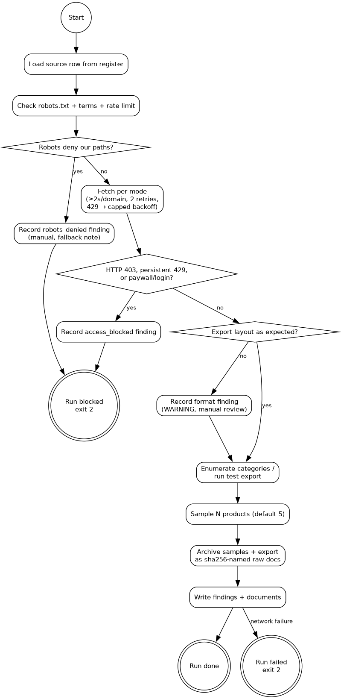

# Data sources — register, access, provenance

## Abstract

This is the operational register of every data source the study draws on:
what each source provides, how it is accessed, at what granularity, under
which terms, and with which verification status. METHODOLOGY.md explains
why these sources are used; ARCHITECTURE.md covers how they are acquired
and stored. All sources are publicly retrievable and free — a hard project
constraint. Every record taken from a source carries its source URL and
retrieval date; raw documents are archived unchanged. The register is
written to be readable without a technical background — terms are
glossed at first use and summarized in the glossary below.

## Terms used (plain-language glossary)

- **Provenance:** the recorded origin of every piece of data — which
  source it came from, from which URL, retrieved on which date.
- **robots.txt:** a small file websites publish to tell automated
  visitors which pages they may or may not fetch; the study's tools
  obey it.
- **(Polite) scraping:** reading web pages automatically — here slowly
  and openly (identified visitor, pauses between requests), never
  bulk-hammering a site.
- **Rate limit:** a self-imposed pause between requests — at most one
  request every two seconds per site.
- **API:** an official, machine-readable data interface offered by a
  statistics provider — preferred over reading web pages wherever one
  exists.
- **CSV export:** a downloadable table file (comma-separated values).
- **CN8:** the 8-digit customs tariff code at which trade statistics are
  reported; "× partner × year" = broken down by trading-partner country
  and year.
- **SKU (stock keeping unit):** one shop item; the study collapses SKUs
  to formulations (one recipe, however many shades or tin sizes).
- **B2B portal:** a business-to-business web shop for professional
  customers.
- **TDS (technical data sheet):** a product's performance data (drying
  time, coverage) — distinct from the safety data sheet (SDS), which
  lists hazardous ingredients (Section 3, from 0.1%).
- **UA string:** the "user agent" identification a program sends with
  each web request; the study's tools identify themselves and carry a
  contact address.
- **sha256 (hash):** a digital fingerprint of a file's content —
  identical files always share it, any change alters it; used to prove
  archived documents are unchanged.
- **PCN / SPIN / PRODCOM / NACE 20.30:** registers and statistics used
  as population proxies — defined in METHODOLOGY.md's glossary.
- **Access DB / mdbtools:** SPIN ships as a Microsoft Access database
  file; mdbtools is the Linux utility that can read it.
- **JS-gated:** a site that only shows its content after running
  JavaScript, so a plain download fails (fedlex) — needs a browser or
  manual copy.

## Source classes

Five classes with stable IDs (the database `source.class` field):

- **CS — customs & trade statistics:** Swiss EZV/swiss-impex (primary:
  structures the Swiss market by origin); Eurostat Comext (EU context).
- **PE — product & SDS evidence (web):** manufacturer/brand sites, B2B
  portals, DIY-chain catalogs, marine chandlers, art-supply shops — the
  sampling frame and the SDS evidence base. Multilingual DE/FR/IT/EN.
- **LG — legal & regulatory texts:** THG, VIPaV, ChemRRV, SECO
  Negativliste, REACH Annexes XIV/XVII, OJ decisions, ECHA registers.
- **ST — structural & product statistics:** ECHA PCN, Nordic SPIN,
  Eurostat PRODCOM/SBS — population proxies and scaling anchors.
- **LI — literature & industry:** peer-reviewed studies, IPEN, CEPE.

## PE — concrete source taxonomy and seed sites

The PE class (product & SDS evidence) is where the actual MSDS/TDS corpus
comes from. There is **no single free EU repository of product safety data
sheets** — the large aggregators (MSDSonline, Chemwatch, SDS Europe) are
paid and excluded by the cost constraint. The corpus is therefore built
from public manufacturer and retailer sites. Four tiers:

| Tier | Sources | What it gives | Lead-relevant streams |
|---|---|---|---|
| **A — Manufacturer/brand SDS libraries** (primary) | AkzoNobel (Dulux, International, Sikkens), PPG, Sherwin-Williams, Jotun, Hempel, Sika, Sto, Caparol/DAW, Alpina, Tikkurila, Teknos, Farrow & Ball | free public SDS PDFs on product pages / SDS portals | all |
| **B — Niche manufacturers** (the lead-relevant ones) | Marine/anticorrosive: Epifanes, Veneziani, Boero, De IJssel, Seajet. Artists' colours: Old Holland, Zecchi, Kremer Pigmente, Michael Harding, Winsor & Newton, Sennelier, Schmincke, Talens, Maimeri, Blockx, Natural Pigments | SDS + TDS for the lead-relevant niches | red lead, artists' colours |
| **C — Retail/B2B portals** | Marine: SVB (svb.de), toplicht.de. CH DIY: Coop Bau+Hobby, Migros Do-it+Garten, Hornbach, Bauhaus, Jumbo, OBI. EU DIY: B&Q, Leroy Merlin, Castorama, Gamma, Praxis, Toom. B2B trade portals (DE/FR/IT) | listings + SDS links, product spec | frame + SDS |
| **D — Free SDS aggregators** | GESTIS (IFA) — substance-level only, not product SDS; a few free SDB sites | substance data, context | context |

**Note on tier D:** GESTIS is substance-level (not product SDS); most
product-level aggregators are paid. Tiers A + C are the practical free
corpus; tier B covers the lead-relevant niches.

**Seed site list** (enumerated/confirmed by the v0.1.1 probe; the register
CSV is the register of record):

- Marine: svb.de, toplicht.de
- Artists': oldholland.com, zecchi.it, kremer-pigmente.com,
  michaelharding.co.uk, winsornewton.com, sennelier.fr, schmincke.de,
  talens.com, maimeri.it
- DIY (CH): coop-bauundhobby.ch, migros-doitgarten.ch, hornbach.ch,
  bauhaus.ch, jumbo.ch, obi.ch
- DIY (EU): hornbach.de, obi.de, bauhaus.de, leroymerlin.fr,
  castorama.fr, gamma.nl, praxis.nl, diy.com (B&Q)
- Majors: akzonobel.com, ppg.com, sherwin-williams.com, jotun.com,
  hempel.com, sika.com, sto.com, caparol.de, tikkurila.com, teknos.com

## Source register

| ID | Class | Source | Provides | Access | Granularity | Status |
|----|-------|--------|----------|--------|-------------|--------|
| CS-1 | CS | swiss-impex.admin.ch (EZV) | CH imports/exports, 3208/3209 (+3213) | web UI / CSV export (to confirm) | CN8 × partner × year | OPEN — free access & granularity to confirm (Phase 0, high priority) |
| CS-2 | CS | Eurostat Comext DS-045409 | EU27 extra-EU trade | public API | CN8 × partner × year | verified (2023 extracted) |
| PE-1 | PE | manufacturer/brand sites | product catalogs, SDS PDFs | polite scraping | product/formulation | OPEN — tier A + B seed list; site list built Phase 1–2 |
| PE-2 | PE | DIY chains (CH candidates: Coop Bau+Hobby, Migros Do-it+Garten, Hornbach, Bauhaus, Jumbo, OBI; EU equivalents: B&Q, Leroy Merlin, Castorama, Gamma, Praxis, Toom) | retail listings | polite scraping | SKU → formulation | OPEN — tier C |
| PE-3 | PE | B2B / trade portals (DE/FR/IT) | professional listings, TDS | polite scraping | product | OPEN — tier C |
| PE-4 | PE | marine chandlers, art-supply shops | niche streams (red lead, artists' colours) | polite scraping | product | partially verified (seed records exist) — tier B/C |
| LG-1 | LG | fedlex / Lexaris | consolidated THG, VIPaV, ChemRRV | download | article | THG verified; current ChemRRV/VIPaV consolidation OPEN (fedlex JS-gated) |
| LG-2 | LG | SECO (Negativliste, five-yearly review report, CdD pages) | exception catalogue, review practice | download | entry | verified |
| LG-3 | LG | EUR-Lex / OJ | REACH consolidated, Annex XIV decisions, 2022 refusal | download | entry | mostly verified; 2022 OJ ref OPEN |
| LG-4 | LG | ECHA (DUR, EC inventory) | authorisation refusals; CAS/EC verification | web | entry/substance | DUR verified; EC-inventory checks pending for 2 CAS |
| ST-1 | ST | ECHA PCN statistics | formulation counts (hazardous mixtures) | public stats | aggregate | OPEN — locate formulation-level aggregates |
| ST-2 | ST | Nordic SPIN (DK/SE/NO/FI) | preparation counts, lead-CAS incidence | free Access-DB download | substance × use × country | available; extraction path OPEN |
| ST-3 | ST | Eurostat PRODCOM / SBS | production values, producer counts | public API | NACE 20.30 | verified |
| LI-1 | LI | studies / IPEN / CEPE | calibration priors | DOI / web | study-level | verified |

The register grows during Phase 0–2; the database `source` table mirrors
it (see DATA_MODEL.md).

## Probing pass (unit v0.1.1)

Before any collection, every OPEN register row is probed once
(`leadhs probe run`, ARCHITECTURE.md M0) — a small, polite test visit
that records what the source actually delivers — and the Status column
is updated from the probe results. The flow per source:

Per class:

- **CS:** swiss-impex (CS-1) — confirm free access, CN8 × partner ×
  year granularity, 2019–2025 coverage, export format; record as probe
  findings. Comext (CS-2) already verified.
- **PE:** enumerate candidate sites per stream (DIY chains, B2B,
  marine/art niches); count catalog products (per category where
  exposed); record robots/terms/rate-limit/languages and SDS
  availability on a small page sample (raw-archived); flag blocked
  sites for the manual fallback rule (D4).
- **ST:** SPIN (ST-2) — download + extraction-path check (mdbtools on
  Slackware); PCN (ST-1) — locate formulation-level aggregates
  (manual-web, recorded like any probe finding).
- **LG:** not probed — legal-text verification stays a manual document
  workstream (Phase-0 legal dossier).

Probing obeys the access & scraping discipline below — light by design
(counts and constraints, not bulk collection). Probe outputs are
provisional frame inputs (MASTER D20).

### Census metadata set (complete source record — v0.1.2)

Per source, the census report must present: identification (id,
class, name, URL, access method, verification status); access
(`free_access`, `robots`, `terms`, `rate_limit`, `extraction_path`,
blocked/denied status + notes); content (`format`, `granularity`,
`coverage_years`, `languages`); counts (`export_rows` /
`catalog_count` / `category_count`; per-HS records 3208/3209/3213
where the source exposes them); availability (`page_sample_ok`,
`sds_sample_ok`); provenance (run keys, timestamps, archived
documents). Framing: these are source-feasibility metrics; product
and lead prevalence are M2+ deliverables and are never implied by
this report (D25).

## Provenance rules (binding)

1. Every scraped record stores `source_id`, `url`, `retrieved_at`.
2. Raw documents (HTML/PDF) are archived exactly as retrieved under
   `data/raw/<source-id>/<sha256>.<ext>` — the filename is a digital
   fingerprint (sha256) of the file's content, so any later change is
   detectable; the database references that fingerprint, and the raw
   store serves as the audit trail.
3. Load-bearing numbers in reports carry source name, year, URL and
   access date (project convention, AGENTS.md).
4. Legal texts are cited by SR/CELEX number and consolidation date
   ("stand"), not by URL alone.

## Access & scraping discipline (binding)

- Publicly retrievable, free sources only — no paid databases, no
  commercial market reports (hard constraint).
- Respect robots.txt and site terms; identify the scraper (UA string with
  contact); rate-limit (default ≤ 1 request / 2 s, per-domain queue); no
  bulk hammering.
- Prefer official exports/APIs over HTML scraping wherever offered
  (swiss-impex CSV, Eurostat API, SPIN download).
- Only publicly posted SDS — no accounts, no paywalls, no ToS
  workarounds (EU law obliges free SDS on request, REACH Art. 31(8), but
  this study uses posted sheets only).
- If a site blocks scraping: manual retrieval of the needed subset;
  record the access method per record.

## DECISIONS

- D1: five source classes (CS/PE/LG/ST/LI) with stable IDs; the `source`
  DB table mirrors this register.
- D2: provenance is binding at record level (URL + retrieval date + raw
  hash), not only at document level.
- D3: official exports/APIs preferred over HTML scraping wherever they
  exist.
- D4: no accounts, no paywalls, no ToS workarounds; manual fallback if a
  site blocks, recorded per record.
- D5: every OPEN register row is probed once before collection (unit
  v0.1.1) and its Status updated from probe findings (MASTER D19).

## OPEN ITEMS

- CS-1 swiss-impex: confirm free access, CN8 × partner granularity,
  multi-year coverage (2019–2025), export format — Phase 0, high
  priority; probe target of v0.1.1.
- PE site list: tier A/B/C seed sites (see "PE — concrete source taxonomy
  and seed sites") to enumerate and prioritize in Phase 1–2 (frame
  construction); confirmation of scrapeability started by the v0.1.1 probe.
- ST-2 SPIN Access DB: extraction path on Slackware (mdbtools?) — OPEN;
  checked during v0.1.1 probing.
- ST-1 PCN: locate formulation-level aggregates (ECHA publishing practice).
- LG-1 fedlex JS-gating for consolidated VIPaV/ChemRRV (browser extraction
  needed) — carried from the legal dossier.

## REFERENCES

- URLs for the sources already verified in the 2026-08-31/09-10 research
  pass: METHODOLOGY.md §REFERENCES. This register adds operational access
  metadata as it is confirmed.
