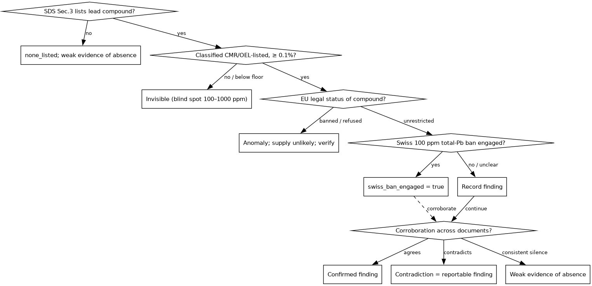

Sprachen: [EN](METHODOLOGY.md) · **DE** · [FR](METHODOLOGY.fr.md)

# Methodik — Grundgesamtheit, Stichprobe, Abgleich

## Zusammenfassung

Dieses Dokument erklärt, wie die Studie den Markt misst — nur mit Dokumenten, bei minimalem Kostenaufwand, ohne Labor. Der Rahmen: Farben unter den Zollpositionen 3208 (lösemittelhaltig) und 3209 (wässrig) auf dem **EU-Markt** (der primäre Gegenstand, mit der impliziten Erwartung «keine»), plus eine vollständige Zählung der Künstlerölfarben (Position 3213). In einfachen Worten: Die Schweizer Aussenhandelsstatistik zeigt, was eingeführt wird, von wo und in welchen Mengen; Hersteller- und Händlerkataloge — systematisch von deren Websites gesammelt und dedupliziert — liefern die Liste der Produkte, aus denen gezogen wird (den «Auswahlrahmen»); weil kein offizielles Register Farbprodukte zählt, wird die Grösse dieser Liste durch Kombination mehrerer unabhängiger Quellen geschätzt (Triangulation). Der Markt wird in acht Gruppen geteilt, jede aufgeteilt nach Herkunft; einige hundert Produkte pro Gruppe werden über ihre Sicherheitsdatenblätter (SDB — die standardisierten Gefahreninformationsblätter, die professionelle Chemieprodukte begleiten) geprüft. Ein zentraler regulatorischer Fakt prägt das Design: Die Schweiz verbietet Farben mit ≥ 0,01 % Gesamtblei (100 ppm — Teile pro Million), während EU-Sicherheitsdatenblätter klassifizierte Bleiverbindungen erst ab 0,1 % deklarieren — die Methode hat daher genau an der regulatorischen Naht einen blinden Fleck, der in allen Ergebnissen offen ausgewiesen wird. Verdächtige Befunde werden abgeglichen — gegen unabhängige Dokumente zum selben Produkt geprüft — statt in einem Labor getestet zu werden. Fachbegriffe werden bei der ersten Verwendung erläutert und im Glossar unten zusammengefasst; die Umsetzungsmapping-Tabelle gegen Ende richtet sich an die technische Leserschaft und kann übersprungen werden.

## ENTSCHEIDE (kondensiert; massgebliche Liste in MASTER.md (EN))

- Analyseeinheit = Basisrezeptur; SKU-Zählung verworfen (MASTER D2).
- Präzisionsbasierte geschichtete Stichprobe, ~2'000–3'000 Produkte, FPC wo Rahmen klein sind (MASTER D4).
- Abgleich statt Labor — harte Randbedingung (MASTER D7).
- HS-3213-Künstlerfarben als vollständige Vollerhebung im Anhang, nicht als Stichprobe (MASTER D13).
- Umsetzung: `leadhs`-CLI-Pipeline gemäss ARCHITECTURE.md (EN); Datenquellen gemäss DATA_SOURCE.md; Schema gemäss DATA_MODEL.md (EN).

## OFFENE PUNKTE

- EZV/swiss-impex — Granularität und freier Zugang (Phase 0) — bestimmt, ob der Rahmen nach Herkunft gewichtet werden kann; Sondierungsziel der Einheit v0.1.1.
- Triangulations-Inputs zur Grundgesamtheit festzulegen (Phase 0) — vorläufige Zählungen kommen mit der v0.1.1-Quellensondierung.
- Mehrsprachiges SDB-Parsing und Dedup-Regeln — Kalibrierung im Phase-1-Pilot.

## Verwendete Begriffe (Glossar in einfacher Sprache)

- **SDB (Sicherheitsdatenblatt / safety data sheet / fiche de données de sécurité):** das standardisierte Informationsblatt, das professionelle Chemieprodukte in der EU und der Schweiz begleiten muss; Abschnitt 3 «Zusammensetzung» listet klassifizierte Gefahrstoffe ab 0,1 % Gewichtsanteil.
- **Rezeptur (Basisrezeptur):** eine Farbrezeptur, egal wie viele Farbtöne oder Gebindegrössen daraus verkauft werden — die Zähleinheit der Studie.
- **SKU (Artikeleinheit):** ein Shop-Artikel (Farbton × Gebindegrösse × Marke); SKU-Zählung würde die Zahlen um das 10- bis 1000-fache aufblähen, ohne Information hinzuzufügen — verworfen.
- **CN8 / HS-Code:** die 8-stellige Zolltarifnummer, unter der eine Sendung deklariert wird (3208 lösemittelhaltige Farben, 3209 wässrige, 3213 Künstlerfarben); «CN» = Kombinierte Nomenklatur, die EU-Tarifnomenklatur.
- **ppm:** Teile pro Million nach Gewicht (10 000 ppm = 1 %).
- **Auswahlrahmen:** die Liste der Produkte, aus der die Stichprobe gezogen wird — hier: Kataloge, dedupliziert auf Rezepturebene.
- **Schicht (Stratum, Mehrzahl Strata) / geschichtete Stichprobe:** ein Marktsegment mit ähnlicher Bleierwartung; Stichprobe innerhalb jedes Segments separat, damit seltene Segmente nicht untergehen.
- **Vollerhebung (Census):** eine vollständige Zählung jedes Mitglieds einer (kleinen) Grundgesamtheit, im Gegensatz zur Stichprobe — verwendet für Künstlerölfarben (3213).
- **Prävalenz:** der Anteil der Produkte in einer Gruppe, die Blei enthalten.
- **Fehlertoleranz / 95%-Konfidenzintervall:** wie nahe ein auf einer Stichprobe gemessener Anteil am wahren Anteil erwartet liegt; das Intervall enthält den wahren Wert in 95 von 100 solchen Stichproben.
- **FPC (Korrektur für endliche Grundgesamtheit):** ein kleiner Abschlag auf die Stichprobengrösse, wenn die Grundgesamtheit selbst klein ist.
- **Triangulation:** eine Grösse schätzen, indem mehrere unabhängige Quellen kombiniert werden, die jeweils einen Teil sehen.
- **Abgleich (Corroboration):** einen Verdacht gegen unabhängige Dokumente zum selben Produkt prüfen.
- **PCN (Notifizierung für Giftnotrufzentralen):** das EU-Register der bei Giftnotrufzentralen notifizierten gefährlichen Gemische — auf Rezepturebene, aber nur gefährliche Gemische umfassend und nicht öffentlich publiziert.
- **SPIN:** die nordische Produktregister-Datenbank (DK/SE/NO/FI); meldet Zählungen von Zubereitungen, die einen bestimmten Stoff enthalten.
- **UFI:** ein 16-stelliger Code auf einem EU-SDB, der die konkrete Rezeptur für Giftnotrufzentralen identifiziert.
- **NACE 20.30:** der statistische Klassifikationscode für «Herstellung von Farben, Lacken und ähnlichen Beschichtungsstoffen».

## Regulatorischer Rahmen und rechtliche Kategorisierung

- **Cassis de Dijon (CH — autonom, nicht bilateral):** Produkte, die rechtmässig in der EU/im EWR verkehrt werden, dürfen ohne Schweizer Neubewilligung auf den Schweizer Markt gebracht werden (THG Art. 16a, autonom übernommen am 1. Juli 2010; eines von drei THG-Instrumenten — MRA gemäss THG Art. 14 ist separat und ausserhalb des Geltungsbereichs). Ausnahmen (Bundesrat; THG Art. 16a Abs. 2 lit. e i.V.m. Art. 4 Abs. 3–4: überwiegende öffentliche Interessen, z. B. Gesundheitsschutz), definiert bei der Entstehung des Prinzips, sind katalogisiert in VIPaV (SR 946.513.8) Art. 2; **Bst. a Ziff. 1 = bleihaltige Farben und Lacke sowie behandelte Artikel (mit Verweis auf ChemRRV Anhang 2.8)** — in Kraft seit 2010, weiterhin gelistet in der SECO-Negativliste vom 1. Januar 2026. Institutionelle Kette: Gesuchsteller/Verantwortlicher = BBL (Auftragskontext 2026-09-10; vor Nennung in Ergebniswerken verifizieren), zuständig für Umsetzung, Überwachung, Revision; Vollzugsbehörde BAFU; **SECO überprüft den gesamten Ausnahmenkatalog alle fünf Jahre** (VIPaV Art. 3; 2023: behalten; nächste ~2028); gesetzliche Grundlage der Listenführung THG Art. 31 Abs. 2 (verifiziert, Lexaris SR 946.51). Die Studie liefert die Entscheidungsgrundlage innerhalb dieses Zyklus, ergebnisneutral.
- **Schweizer Stoffverbot:** ChemRRV Anhang 2.8 (Fassung 2005; aktueller Text OFFEN) definiert Bleifarben als solche mit Gesamt-Pb ≥ 0,01 % (100 ppm) und verbietet deren Inverkehrbringen (sowie behandelte Artikel) — strenger als die EU, die nur Bleicarbonate/-sulfate *in Farben* verbietet (Annex XVII 16/17) und die rechtmässige Bleichromat-Versorgung über die Zulassungsverweigerung beendete (17. März 2022).
- **Grenze Chemikalienrecht/CdD (Anmeldestelle Chemikalien):** Ein Produkt kommt entweder unter schweinisches Chemikalienrecht oder unter CdD auf den Markt — nicht gemischt; Folgepflichten (Produktregister, SDB) überleben CdD.
- **Designkonsequenz — Feld «Rechtskategorie»:** jeder Datenbankeintrag führt: HS/CN-Code (inferiert), Rechtskategorie (Anstrichfarbe / Malfarbe / Pigment / behandelter Artikel), Herkunft (CH/EU/Drittland) und ob das Schweizer 100-ppm-Gesamt-Pb-Verbot plausibel greift (deklarierte Verbindungen und Spannen) — die SDB-Methode kann Gesamt-Pb nicht messen.
- **Hauptvorbehalt:** Schweizer Verbotschwelle 100 ppm Gesamt-Pb < EU-SDB-Deklarationsschwelle 0,1 % (1000 ppm, klassifizierte Verbindungen). EU-rechtskonforme, vollständig dokumentierte Produkte können das Schweizer Verbot dennoch unsichtbar für diese Studie überschreiten. Ausgewiesen in jedem Ergebniswerk; experimentell nicht einbindbar (kein Labor).

## Grundgesamtheit und Definition

- Zielpopulation: unterschiedliche Farb-/Lackrezepturen (HS 3208/3209), verfügbar auf dem **EU-Markt** — der primäre Gegenstand —, mit dem **Schweizer Markt als zusätzlicher Messgrösse** (inländische Produktion + Importe; die Schweizer 100-ppm-Regel legt sich über die EU-rechtskonforme Präsenz). EU/EWR-Bevölkerungsschätzungen dienen auch als Skalierungsanker.
- **Kein Register zählt diese** — die Populationsgrösse muss trianguliert werden.
- Einheit = Basisrezeptur: Farbtöne werden als eine notifiziert (KemI-Praxis); Abtönvarianten am Point of Sale sind keine eigenen PCN-Einträge (Verordnung (EU) 2020/1676). Zählung auf SKU-Ebene wird ausdrücklich verworfen (bläht N um 1–3 Grössenordnungen auf, ohne Information hinzuzufügen).
- Arbeitshypothese: **10⁴–10⁵ Rezepturen EWR-weit**; Schweizer Rahmen plausiblerweise eine Grössenordnung kleiner (in Phase 0 festzulegen). EU-Anker: ~3'200 EU27-Hersteller (NACE 20.30, Eurostat SBS 2019–20); CEPE ~800 Mitglieder ≈ 85 % von €17 Mrd.; EU27-Aussenhandel €1,1 Mrd. ein / €4,3 Mrd. aus, ~860 kt (2023, Comext DS-045409, CN8-Summen berechnet).
- **Vollerhebungs-Anhang — HS 3213 Künstlerölfarben:** Künstlerfarben mit Bleipigmenten (Blei-/Cremnitzweiss PW1, Neapelgelb PY41, Bleizinngelb, Bleimennige) liegen ausserhalb von 3208/3209 (CN 2026: 3213 10 00 / 3213 90 00) und sind unsichtbar in aussenhandelsstatistischen Rahmen — dennoch der klarste dokumentierte Fall von Bleifarben, die sich rechtmässig auf dem EU-Markt befinden (Old Holland NL; Zecchi IT; Michael Harding UK→EU unverifiziert). Die Grundgesamtheit ist klein (Dutzende Marken) → **vollständige Vollerhebung, keine Stichprobe**: Marken aufzählen, Kataloge/SDB pro Land prüfen, Bleipigmente und allfällige nationale Beschränkungen erfassen (z. B. SE-Regime nur für Fachleute).

## Aufbau des Auswahlrahmens

1. **Schweizer Aussenhandelsstatistik (EZV/swiss-impex):** Importe/Exporte auf CN8-Ebene nach Partnerland, mehrjährig — strukturiert den Markt nach Herkunft und gewichtet die Herkunftsdimension jeder Schicht. Verfügbarkeit/Granularität in Phase 0 zu bestätigen (OFFEN). 3213 für den Vollerhebungs-Anhang einschliessen.
2. **Schweizer und EU-Hersteller-/Händlerkataloge** (B2B-Portale, DIY-Ketten, Markenseiten; DE/FR/IT), gelesen und auf Rezepturebene dedupliziert — der eigentliche Auswahlrahmen und das Datenbank-Grundgerüst. Der EU-Strang nutzt dieselbe Methode auf EU-seitigen Katalogen; Seed-Produkte in den Akten: Epifanes WERDOL Bleimennige (DE-Marinehändler, SDB 2021), BRAVA blymönja (SE, nur Fachleute, Bewilligung), Old Holland Cremnitz White No. 3 (PW1), Zecchi (biacca, giallorino, minio, PY41-Ölfarbe).
3. **EU-seitige Näherungen (Kontext/Skalierung):** ECHA-PCN-Statistiken (Rezepturebene, EWR-weit, nur gefährliche Gemische; ~19 % Nicht-Notifizierung gemäss ECHA-Forum-Pilot H1-2025 → Untererfassungsfaktor); Nordischer SPIN (DK/SE/NO/FI-Produktregister; ~1-GB-Access-DB; Zählungen pro Verwendungskategorie; stoffspezifische Blei-CAS-Abfragen möglich; Produktnamen vertraulich); Eurostat PRODCOM.
4. **Schweizer Strukturstatistiken** (BFS/SBS): Herstellerzählungen und Produktionswerte im Inland.

## Schichtung (Entwurf: 8 Segment-Schichten × Herkunft)

| # | Schicht | CN-Prior | Blei-Prior |
|---|---|---|---|
| S1 | Dekorative wässrige Farben | 3209 | ~0 |
| S2 | Dekorative lösemittelhaltige/Alkyd | 3208 | sehr niedrig (Trockenstoffe möglich — zentraler offener Strom) |
| S3 | Korrosionsschutz-/Stahlbau-Grundierungen | 3208 | **hoch (Bleimennige; dokumentierte EU-Nische)** |
| S4 | Marine- & Container-Beschichtungen | 3208 | hoch (dokumentiert: WERDOL) |
| S5 | Strassenmarkier-/Verkehrsfarben | 3208 | mässig (Altlast PbCrO₄; Turner & Filella 2022: 63 % der Proben >10 mg/kg) |
| S6 | Industrielle OEM (Coil, Refinish, Maschinenbau) | 3208 | mässig (Chromate endeten 2022) |
| S7 | Drittland-Importmarken | beide | **hoch** (Prävalenz der Herkunftsmärkte) |
| S8 | Restsegment (Holz, Boden, Spezialitäten) | beide | niedrig |

Plus der **3213-Vollerhebungs-Anhang** (Künstlerfarben, keine Stichprobe). Jede Schicht wird nach Herkunft aufgeteilt — CH-Produktion / EU-Import / Drittland-Import — mit Zügen, gewichtet nach EZV-Importanteilen (Phase 0).

## Stichprobengrösse (präzisionsbasiert)

- Die Standardformel für die Stichprobengrösse (n = z²·p(1−p)/e² — in Worten: die zu prüfende Anzahl hängt von der angestrebten Fehlertoleranz und dem erwarteten Anteil ab, **nicht** von der Grösse des Marktes) ergibt: **385** Produkte pro Gruppe für ±5 % Fehlertoleranz; **≈ 811** für ±1,5 % bei selteneren Vorkommnissen (95 % Konfidenz).
- FPC (Korrektur für endliche Grundgesamtheit — ein Abschlag, wenn die Gruppe selbst klein ist): n/(1+n/N).
- Gesamtdesign ≈ 2'000–3'000 Produkte; Pilot ≈ 300–800.
- Hinweis: Entscheidend ist, wie viele Produkte geprüft werden, nicht welcher Marktanteil das repräsentiert; liegt die Gesamtpopulation N ≈ 30–50k, landet das Design beiläufig bei 5–10 %.

## Bleibestimmung (nur Dokumente)

- Primär: SDB-Abschnitt-3-Parsing gegen das Blei-Wörterbuch (siehe `LEAD_SDS.md` (EN)); Konzentrationspannen, Klassifizierung, Veraltung (Format vor 2021/878 = rote Flagge), UFI, Abschnitt-15-Aussagen erfassen. SDB für CH/EU-Markt typischerweise in DE/FR/IT/EN — Sprachbehandlung in der Pipeline nötig.
- Sekundär/Zählungen: SPIN-Blei-CAS-Zubereitungszählungen (nordische Kontextschätzung für das EU-Registerumfeld).
- **Abgleich statt Labor (kein Labor, harte Randbedingung):**
  - jeder Verdachtsbefund wird, wo verfügbar, gegen unabhängige Dokumente zum selben Produkt abgeglichen: technische Datenblätter, Etikettentext, Händler-Listings, Herstellererklärungen, ältere SDB-Versionen, markenübergreifende Varianten über Märkte;
  - Konsistenz-Score; Widersprüche zwischen Dokumenten sind selbst berichtenswerte Befunde;
  - konsistentes Schweigen über mehrere unabhängige Dokumente = schwache Evidenz der Abwesenheit, als solche berichtet.
- **Ausgewiesene Einschränkungen (quantifiziert über Annahmen, nicht Messung):** nur deklariertes Blei (≥0,1 % klassifizierte Verbindungen); das Band 100–1000 ppm (Schweizer Verbot unter der EU-Deklarationsschwelle), Begleitblei und unter-deklarierende oder veraltete Blätter sind unsichtbar. Die Schluss-Entscheidungsgrundlage trägt eine explizite Einschränkungen-Sektion.

## Schweizer Aussenhandel & rechtlicher Arbeitsstrang (Phase 0, nur Dokumente)

- EZV/swiss-impex-Extraktion: CN8 × Partner, 2019–2025, 3208+3209 (+3213).
- Aktuelle konsolidierte Texte verifizieren: ChemRRV Anhang 2.8 (SR 814.81) — Schwelle, behandelte Artikel, Ausnahmen; VIPaV (SR 946.513.8) — Art.-2-Katalog und Art.-16-Text; FR-Wortlaut.
- Die CdD-Governance-Kette der Bleiausnahme aus öffentlichen Quellen dokumentieren: Gesuchsteller-/Verantwortungsamt, Überprüfungsverfahren (VIPaV Art. 3), Entstehungsprotokoll 2010 (erläuternder Bericht/Botschaft) — BBL-Rolle derzeit nur gemäss Auftragskontext.
- EU-Ebene: OJ-Referenz der Zulassungsverweigerung für Bleichromate vom 17. März 2022; ECHA-Leitfaden (falls vorhanden) zu Annex XVII 16/17 vs. Künstlerfarben; FR/IT-Abfrage nach Bleimennige-Grundierungen im Handel.

## Umsetzungsmapping

| Methodenschritt (dieses Dokument) | Pipeline-Stufe | CLI | Datenentitäten |
|---|---|---|---|
| Quellenzensus & Sondierung | probe | `probe run`, `probe report` | probe_run, probe_finding → population_anchor |
| Rahmenaufbau (Kataloge) | acquire, ingest | `acquire run`, `ingest sightings` | product, sighting |
| Aussenhandelsstatistik | acquire, ingest | `acquire run` (CS-1/CS-2) | trade_stat |
| Schichtung & Populationen | frame | `frame set` | frame_stratum, population_anchor |
| Stichprobengrösse & Ziehung | sample | `sample plan`, `sample draw` | sampling_run, sample_selection |
| Bleibestimmung | parse | `parse sds`, `review` | sds_finding, lead_compound |
| Abgleich | corroborate | `review`, `corroborate` | corroboration |
| Vollerhebungs-Anhang (3213) | ingest, parse | census-markierte Produkte | product |
| Analyse & Bericht | analyze, report | `analyze prevalence`, `report build` | abgeleitet + alle |

## Diagramme

`charts/lead-decision-tree` bildet die Bleibestimmungs- und Blinder-Fleck-Logik dieses Dokuments als Entscheidungsbaum ab:

Strategiediagramme sind Vorschläge — die geschriebenen Dokumente gewinnen. Index: `charts/README.md` (EN).

## REFERENZEN (abgerufen 2026-08-31; THG/CdD-Ergänzungen 2026-09-10)

- SECO-Negativliste CdD, 1. Januar 2026: seco.admin.ch/dam/de/sd-web/8jJ6a7UYFYzf/Negativliste-SECO-Januar-2026-DE.pdf
- SECO/WBF-Fünfjahresüberprüfungsbericht, 29. März 2023: seco.admin.ch/dam/de/sd-web/jUlHD7NFv0hM/BERICHT_Fünfjährige Überprüfung der CdD-Ausnahmen gemäss Art. 3 VIPaV, 2023.pdf
- SECO Cassis-de-Dijon-Seite: seco.admin.ch/de/cassis-de-dijon-prinzip
- SECO-THG-Seite (drei Instrumente): seco.admin.ch/de/bundesgesetz-technische-handelshemmnisse
- THG SR 946.51 Volltext, Stand 1. Mai 2017 (Lexaris; Art. 4, 16a, 31 Abs. 2): lexaris.de/book/version/documentflat/head/222871
- SECO-MRA-Seite (nur Abgrenzung des Geltungsbereichs): seco.admin.ch/de/allgemeine-informationen-mra
- Anmeldestelle Chemikalien, CdD-Leitfaden: anmeldestelle.admin.ch/de/cassis-de-dijon
- THG Art. 16a (Stand 2010, archiviert): web.archive.org/web/20101011224435/http://www.admin.ch/ch/d/sr/946_51/a16a.html
- VIPaV SR 946.513.8, Art. 1–2 (Stand 2010, archiviert): web.archive.org/web/20101011224439/http://www.admin.ch/ch/d/sr/946_513_8/a2a.html
- ChemRRV Anhang 2.8 (Stand 2005, archiviert): web.archive.org/web/20060210084345/http://www.admin.ch/ch/d/sr/814_81/app23.html
- EuGH 120/78 Rewe/Cassis de Dijon: eur-lex.europa.eu/legal-content/DE/TXT/HTML/?uri=CELEX:61978CJ0120
- EuGH C-389/19 P (25. Februar 2021, aufrechterhaltene Wirkungen): iclr.co.uk/document/2021000886/casec38919p/html ; EuG T-837/16 (7. März 2019): eur-lex.europa.eu/legal-content/EN/TXT/?uri=celex:62016TJ0837
- ECHA-Downstream-Use-Register (alle Bleichromat-Zulassungen verweigert): echa.europa.eu/du-66-notifications
- Turner & Filella 2022, Strassenfarben, 11 Länder: DOI 10.1016/j.envpol.2022.120492
- Epifanes WERDOL Bleimennige (SDB 2021 + Listings): toplicht.de/de/farben-bootsbau/farben-konservierung/grundierungen/ueber-wasser/5911/epifanes-werdol-blei-mennige
- BRAVA blymönja (SE, nur Fachleute): raseglarhuset.com/frg-fernissa/blymja
- Old Holland Cremnitz White No. 3 (PW1): oldholland.com/classic_oil_colours/d3-cremnitz-white/
- Zecchi (biacca, giallorino, minio, PY41): zecchi.it/products.php?category=29 ; category=36
- CN 2026 Position 3213: zolltarifnummern.de/2026/3213
- Schweizer Zollhandelsplattform (geplante Phase-0-Quelle): swiss-impex.admin.ch
- Eurostat Comext DS-045409 API: ec.europa.eu/eurostat/api/comext/dissemination/statistics/1.0/data/DS-045409
- Eurostat SBS sbs_na_ind_r2 (NACE C2030): ec.europa.eu/eurostat/api/dissemination/statistics/1.0/data/sbs_na_ind_r2
- CEPE: cepe.org/about-the-industry/
- ECHA-Forum-PCN-Pilot (Februar 2026, über Sekundärquelle): cirs-group.com/en/chemicals/echa-releases-pilot-project-report-on-pcn-enforcement-nearly-20-of-companies-failed-to-meet-compliance-obligations
- SPIN: web.archive.org/web/20250116153625/http://spin2000.net/ ; DB-Download: web.archive.org/web/20240615081956/http://spin2000.net/?page_id=54
- KemI-FAQ (Mit-Notifizierung von Farbtönen): web.archive.org/web/20210227095243/https://www.kemi.se/fragor-och-svar/fragor-och-svar-om-produktregistret
- CN-2025-Codes: zolltarifnummern.de/2025/3208, /3209 (validiert gegen Comext-Codeliste)
