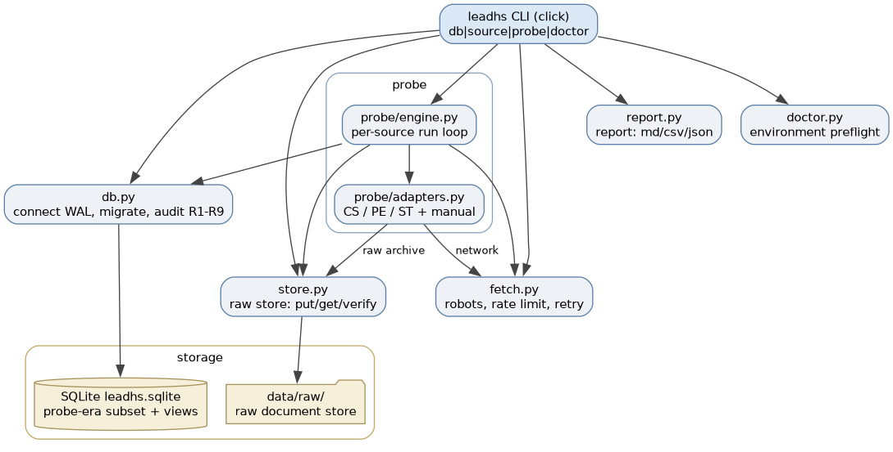

# Architecture — pipeline, CLI, reporting

## Abstract

The study's light data-engineering side is a single-user, no-server
pipeline: acquire documents → archive raw → ingest → parse SDS → build
the frame → draw reproducible samples → screen and corroborate → analyze
→ generate the report. One CLI (`leadhs`) drives all stages; state lives
in one SQLite database plus a raw-file store; every number in the final
report is generated from the database — nothing hand-copied. This
document fixes the strategy-level shape; detailed module design belongs
to [20_DESIGN](../plan/3SM/20_DESIGN/MASTER.md) in the plan tree.

## Stack (decided at strategy altitude)

- **Python ≥ 3.11**, stdlib-first (sqlite3, dataclasses, pathlib).
- Small dependency set: `requests`, `beautifulsoup4`, `click` (CLI),
  `jinja2` (reports), `pypdf` (PDF text; `pdftotext`/poppler preferred
  backend when available).
- Optional: `matplotlib` (charts), mdbtools route for the SPIN Access DB.
- **No servers, no services, no daemons** — fits Slackware/no-systemd
  and the minimal-cost constraint; every stage is a CLI step.
- Persistence: SQLite + raw store (DATA_MODEL.md).
- Orchestration: GNU Make (`Makefile`, repo root) as the stable
  operator entrypoint; one target = one `leadhs` call (v0.1.2, D8).

## Pipeline stages

    probe → acquire → raw store → ingest → parse → frame → sample →
    screen → corroborate → analyze → report

0. **probe** (unit v0.1.1) — source census before any collection:
   per-source counts (catalogs, categories), access constraints
   (robots/terms/rate limits/languages), format checks (swiss-impex
   export, SPIN extraction path), sample pages as raw evidence;
   results land in `probe_run`/`probe_finding` and feed provisional
   population anchors (DATA_MODEL.md).

1. **acquire** — per-source fetchers (CS exports, PE polite scraper, LG/ST
   downloads); rate-limited, per-domain queues, robots-aware; official
   APIs/exports preferred (DATA_SOURCE.md discipline).
2. **raw store** — documents archived as retrieved (sha256-named); the DB
   references hashes: auditability before parsing.
3. **ingest** — sightings/products/manufacturers upserted with dedup;
   sources registered.
4. **parse** — SDS PDF → text → sections (multilingual DE/FR/IT/EN);
   Section 3 compound extraction against the dictionary (CAS/EC/synonyms);
   concentration ranges; UFI; Section 15 flags; confidence-tagged.
5. **frame** — stratum × origin population counts from catalogs +
   triangulation anchors → `frame_stratum`.
6. **sample** — parameterized, seeded draws.
7. **screen** — review queue for selected products (no SDS? not a paint?
   duplicate?) — manual decisions with CLI support.
8. **corroborate** — cross-document checks for suspected positives
   (TDS/labels/listings/older SDS/cross-market variants) with consistency
   scoring.
9. **analyze** — prevalence per stratum × origin (Wilson CIs), FPC, trade
   overlay, census annex tables.
10. **report** — templates rendered from the DB.

## CLI surface (`leadhs`)

    leadhs db init|status|audit          # schema, counts, provenance check
    leadhs source load|list|add          # seed register from repo CSV; manage
    leadhs probe run --source PE-1|--all # source census → probe_finding
    leadhs probe report                  # census summary + anchor candidates
    leadhs probe download-csv-sample     # per-registry 100-row seeded CSV
                                         # samples + manifest (v0.2.4, D36)
    leadhs acquire run --source PE-1     # rate-limited fetch → raw store
    leadhs ingest sightings --file …     # upsert products/sightings
    leadhs parse sds [--product ID|all]  # parse queue → findings
    leadhs review next|decide ID …       # screening & parse-confidence queue
    leadhs frame set --stratum S3 --origin EU --population N --method …
    leadhs sample plan --p 0.05 --precision 0.015 --confidence 0.95 \
                       --fpc --strata S2,S3 --seed 42   # computes n, stores run
    leadhs sample draw --run RUN_ID      # reproducible selection
    leadhs analyze prevalence --run RUN_ID
    leadhs report build --run RUN_ID --lang de|fr|en --out docs/report/

The core user flow — set sampling parameters, run, get a report — is:
`sample plan` → `sample draw` → (screen/corroborate) → `analyze` →
`report build`.

The Makefile wraps these one-call-per-target; `make help` is the
operator index. Composite flows (census) stay in make until the CLI
grows matching commands.

## Rollout (implementation order; v0.1.1 = M0)

- **M0 — probe (unit v0.1.1):** `db init/status`, `source load/list`,
  `probe run/report`. Schema subset: `schema_version`, `source`,
  `probe_run`, `probe_finding`. Delivers the source census and
  provisional population anchors; nothing else is implemented.
- **v0.1.2 — operator layer (between M0 and M1):** Makefile, CLI
  operability fixes, report routing; no new pipeline stages.
- **v0.1.3 — data-landscape map (between M0 and M1, D29):** census
  close-out execution, channel enumeration, census-walk extension
  (`products_listed` / `doc_links_seen`), coarse SPIN/PCN/PRODCOM
  priors, latest-year trade context; reuses the od8 report layer —
  no new CLI commands, no new pipeline stages.
- **M1 — frame & sample (deferred until the landscape map justifies
  a frame; gated by its frame-decision bridge):** `frame set`,
  `sample plan`, `sample draw` (probe counts + trade stats → strata;
  parameters p/precision/confidence/FPC/seed).
- **M2 — acquire & parse:** `acquire run`, `ingest sightings`,
  `parse sds`, `review` — pilot on 1–2 strata (lead driers first),
  then full n.
- **M3 — corroborate & analyze:** `corroborate`, `analyze prevalence`.
- **M4 — report:** `report build` (DE/FR/EN), database freeze.

Remaining tables migrate with their milestone (probe results may
reshape frame/sample entities); the full schema stays as designed in
DATA_MODEL.md.

## Repository layout (target)

    src/leadhs/            # package: cli, db, acquire/, parse/, frame,
                           # sample, analyze, report/ (templates), dict/
    Makefile               # operator entrypoint (v0.1.2)
    data/raw/              # gitignored raw store
    data/leadhs.sqlite     # gitignored database
    data/report/           # gitignored report renders — timestamped per
                           # run (render history, v0.2.3 addendum), latest
                           # copies kept for stable references
    docs/report/           # published final reports only (committed)
    tests/                 # pytest: parse fixtures, seed reproducibility,
                           # CLI smoke
    pyproject.toml

## Distribution & portability

Audience (decided 2026-09-11): author + technical peers on
Linux/macOS/Windows; terminal use presumed. That fixes the model —
**ship a standard wheel, install with a managed interpreter; do not
bundle.**

- **Install route:** `uv tool install <wheel URL>` (pipx equivalent) —
  identical on all three platforms; uv fetches Python 3.11+ itself when
  missing. Repo-developer path stays `make install` (editable). Wheels
  attach as GitHub release assets; **no public PyPI footprint** (name
  discoverability; commissioning context stays implicit).

- **Portability policy:** the core stays pure-Python — pypdf is the
  default PDF backend; poppler/mdbtools remain optional accelerators,
  detected at runtime (`leadhs doctor`), never install requirements.
  pathlib-only paths; installed (non-repo) use gets an explicit data
  dir (`--data-dir`), never CWD-implicit writes; SQLite + raw store
  stay relocatable by copy (zip and move).

- **Rejected as distribution vehicles:** Docker (Win/Mac = Linux VM
  under Docker Desktop; multi-GB proprietary runtime with license
  limits, volume-mount/ownership friction, SQLite-on-bind-mount
  caveats — solves a native-dependency problem this stack does not
  have; a dev/CI image may be added later, it is not the shipping
  vehicle); AppImage (Linux-only by definition); conda-forge (no
  conda-native audience); language rewrite (cost).

- **Contingency (recorded, not built):** if a genuinely non-technical
  recipient ever materializes, PyInstaller per-OS bundles via a CI
  matrix (windows-latest; macOS arm64+x64; Linux tarball/AppImage
  optional) — accepting Windows SmartScreen click-through and macOS
  notarization costs (Apple Developer ~USD 99/yr). Built only then,
  never speculatively.

**Update 2026-09-12 (D32):** that recipient has materialized as an
explicit goal — **vanilla Windows must be served in v0.3**: an install
that needs no make and no preinstalled Python, via a self-contained
per-OS artifact (PyInstaller bundle or equivalent single-file
installer; mechanism decided in v0.3 design). The contingency above is
thereby promoted to planned scope; PyPI publication stays unnecessary
and GitHub release assets remain the channel — the bundled Windows
artifact ships alongside the wheel.

## Report concept

- **Generated technical report** (jinja2 → Markdown; PDF via pandoc when
  available): title/abstract; regulatory frame (static text, verified
  references); Swiss trade analysis (tables from `trade_stat`);
  prevalence per stratum × origin with confidence intervals; the
  blind-spot/limitations section (mandatory — MASTER decision 15);
  corroboration findings; 3213 census annex; evidence-database
  description; annexes (compound dictionary, product evidence table).
  Every figure rendered from the DB, cited with run ID + seed.
- **Languages:** DE primary (federal actors), FR secondary, EN optional
  (EU leg). The hand-maintained bilingual `docs/management_summary.md`
  is never overwritten by generated artifacts.
- Intermediates are regenerated freely; final report versions are
  committed with their run IDs.
- Routing: intermediates → `data/report/`; publishing → `docs/report/`
  is an explicit act (`make report-publish`). Finals are committed with
  their run IDs.
- Render history (v0.2.3 addendum): every `make report` leaves an
  immutable timestamped set in `data/report/` (one shared UTC ts per
  run); the unversioned names are refreshed as "latest" copies.

## Testing & quality (light but real)

- pytest; golden-file SDS parse fixtures (real sheets, anonymized);
  seed-reproducibility test (same run → same selection); CLI smoke
  tests; `db audit` checks provenance completeness (no finding without
  source/hash).

## Failure behavior (principles)

- acquire: per-domain backoff, resume; blocked sites → recorded manual
  fallback, never hammering.
- parse: confidence-tagged, nothing silently dropped — low-confidence
  extractions queue for manual review.
- db: append-only corrections; forward-only migrations.

## Rendered diagrams

`charts/architecture-components` — the `leadhs` system (module detail
per [20_DESIGN](../plan/3SM/20_DESIGN/MASTER.md)):

`charts/probe-process` — the M0 probe workflow (re-rendered 2026-09-11
to match the reviewed run semantics):

Strategy diagrams are proposals — the written documents win. Index:
`charts/README.md`; superseded charts (pipeline data flow, run states,
data-model ER) are archived under `../../plan/3SM/_archive/10_STRATEGY/charts/`.

## DECISIONS

- D1: no-server, single-user CLI pipeline; SQLite + raw store
  (alternatives — Postgres, workflow engines, web app — rejected as
  cost/complexity).
- D2: one CLI (`leadhs`, click) drives all stages; parameters and seeds
  are first-class run attributes.
- D3: reports are generated from the DB only — no hand-copied numbers;
  hand-maintained and generated documents never mix.
- D4: raw store before parsing (auditability); official exports over
  scraping.
- D5: stdlib-first, small dependency set, Python ≥ 3.11.
- D6: probe-first rollout — M0 (v0.1.1) ships probing tools only; the
  full surface is implemented progressively (MASTER D19).
- D7: probing is a first-class pipeline stage with its own entities
  (`probe_run`/`probe_finding`), not an ad-hoc script (MASTER D20).
- D8: operator layer lives in make — thin wrapper, pipeline logic
  gravitates into the CLI (MASTER D21).
- D9: report intermediates in `data/report/`, explicit publish to
  `docs/report/` (MASTER D22).
- D10: distribution = standard wheel + managed interpreter (`uv tool
  install`/pipx) for author + technical peers; wheels as GitHub
  release assets, no public PyPI (2026-09-11).
- D11: portability = pure-Python core as policy (native tools
  optional, runtime-detected); no bundling; Docker/AppImage rejected
  as distribution vehicles; PyInstaller per-OS builds are the
  recorded contingency for a non-technical audience.

## OPEN ITEMS

- PDF text extraction backend (pdftotext vs pypdf) — decide on a real
  CH/EU SDS corpus in Phase 1.
- Multilingual section-detection heuristics (SDS layouts vary by vendor)
  — pilot calibration.
- swiss-impex export format → `trade_stat` ingest path (Phase 0; probe
  target of v0.1.1).
- Chart rendering (matplotlib vs table-first) — Design.
- Report PDF route (pandoc availability on Slackware) — Design.
- Config-file parameter surface (sampling p/precision/confidence/seed,
  per-source budgets) — introduce at M1 (MASTER D21).
- Release mechanics (implementation): tag → wheel → GitHub release
  asset; install smoke-test on Linux/macOS/Windows; document the two
  install paths (repo `make install`; peer `uv tool install`) in the
  README at first external use.
- Data-dir default for installed (non-repo) use (platformdirs vs
  explicit-only) — Design.
